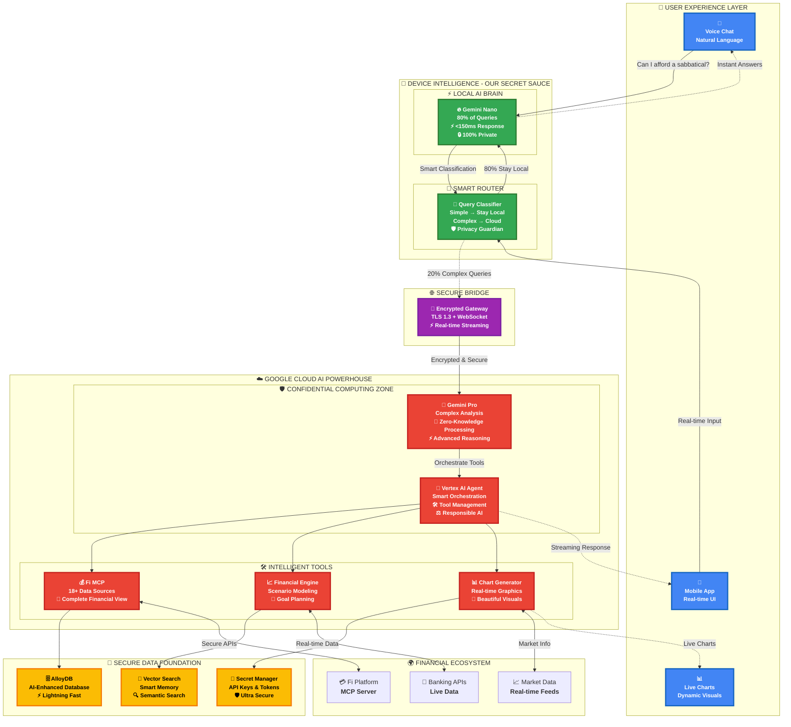
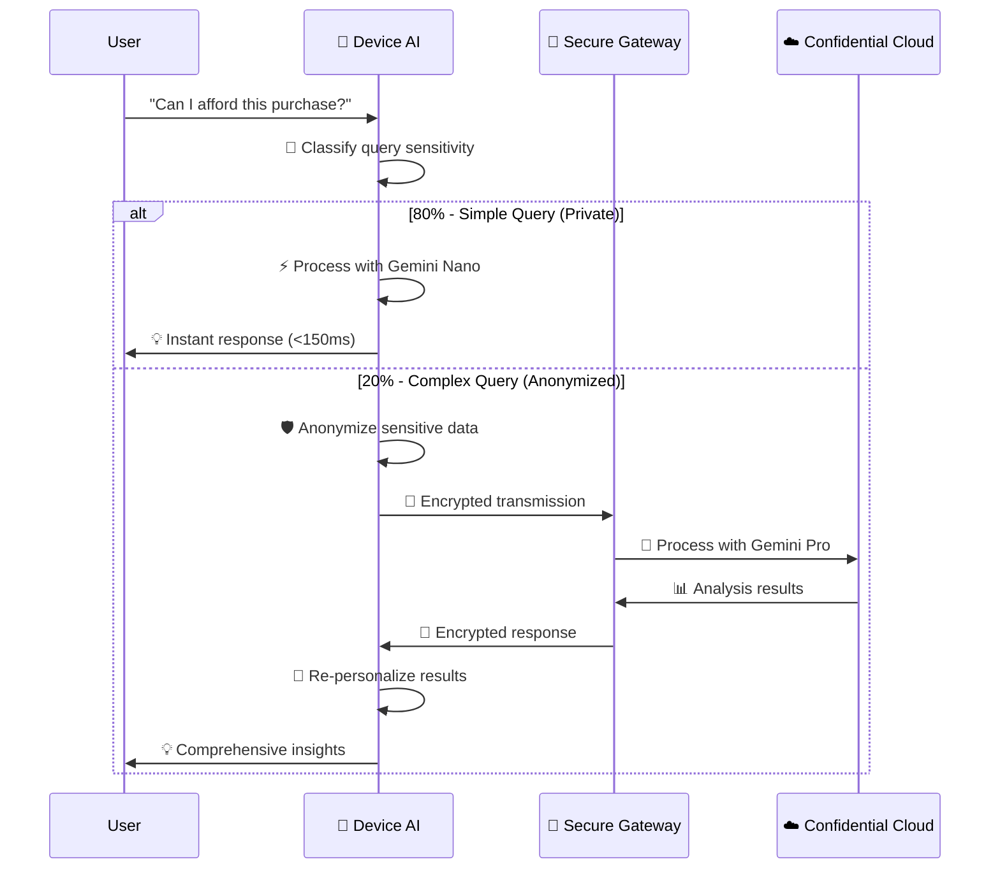

Certainly! Here's the properly formatted and polished version of your README.md file with consistent Markdown styling, clean sections, and correct code block formatting, preserving all your original content:

---

# 🔮 AvestoAI: Your Financial Prophet  
**Google Agentic AI Hackathon 2025 - Revolutionary Financial Intelligence**

<p align="center">
  
  
  
  
  
</p>

<p align="center">
  <strong>🚀 The First AI That Predicts and Prevents Financial Mistakes Before They Happen</strong>
</p>

---

## 🎯 The Breakthrough: From Reactive to Predictive Finance

**What if your money could warn you about mistakes before you make them?**

AvestoAI isn't just another financial chatbot. It's the world's first **hybrid on-device + cloud financial intelligence** that:

- 🔮 **Predicts financial stress 7-30 days ahead**  
- 💡 **Proactively hunts for optimization opportunities**  
- 🎯 **Scores every financial decision** with AI precision  
- 🛡️ **Processes sensitive data locally** for ultimate privacy  
- ⚡ **Responds in <150ms** for 80% of queries  

> **"See your financial future before you live it"** - The only AI that thinks about your money so you don't have to.

---

## 🏗️ Revolutionary Hybrid Architecture

Our **secret sauce** is the industry-first hybrid intelligence system:



### 🚀 **The Innovation: 80/20 Hybrid Intelligence**

- ⚡ **80% Local Processing**: Common queries processed instantly on-device with Gemini Nano  
- 🧠 **20% Cloud Intelligence**: Complex analysis powered by Gemini Pro in confidential computing zones  
- 🎯 **Smart Routing**: AI classifier automatically determines optimal processing location  
- 🔒 **Privacy-First**: Sensitive financial data never leaves your device unnecessarily  

---

## ✨ Revolutionary Features

### 🔮 **Predictive Financial Prophet**

```python
# Real example of our prediction engine
prediction = await financial_prophet.predict_future_stress(
    timeline="30_days",
    current_patterns=user_spending_data,
    market_conditions=live_market_data
)

# Output: "Alert: 73% chance of cashflow stress on March 15th. 
#         Suggested action: Defer ₹25k purchase by 1 week."
```

### 💡 **Autonomous Opportunity Hunter**

- High-Yield Savings Detection: "Move ₹180k to earn ₹7,200 more annually"  
- Investment Optimization: "Increase SIP by ₹5k → ₹12L additional wealth in 10 years"  
- Tax Efficiency: "Save ₹45k annually with 80C optimization"  
- Spending Intelligence: "Reduce dining costs 25% → ₹18k yearly savings"  

### 🎯 **Real-Time Decision Scoring**

Every financial decision gets an AI-calculated **"Future Self Score"** (0-100):

| Decision                   | Score    | AI Reasoning                                                    |
|---------------------------|----------|----------------------------------------------------------------|
| 💻 MacBook Pro ₹150k       | **67/100** | "Moderate alignment. Consider 3-month delay to save cash."    |
| 🏠 House Down Payment ₹20L  | **89/100** | "Excellent timing. Market conditions favorable."              |
| 🎮 Gaming Setup ₹80k        | **23/100** | "High opportunity cost. Investing generates ₹2.4L in 5 years." |

### 🗣️ **Natural Voice Interface**

```
"Hey AvestoAI, can I afford a 6-month sabbatical?"

"Based on your current runway of ₹3.2L and monthly expenses of ₹45k, 
you can afford 7 months. However, I predict market opportunities in Q3 
that could extend this to 10 months if you optimize now."
```

---

## 🛠️ Tech Stack Excellence

### Frontend Interfaces

```yaml
Primary Demo: 
  - Chainlit: AI-native chat interface (fastest to wow judges)
  - Real-time streaming responses
  - Embedded Plotly visualizations

Production App:
  - Flutter Web: Cross-platform financial dashboard
  - Material Design 3
  - Progressive Web App capabilities
```

### Backend Intelligence

```yaml
API Framework: FastAPI
  - Async/await for high performance
  - Auto-generated OpenAPI docs
  - Built-in validation and serialization

On-Device AI:
  - Gemini Nano via WebAssembly
  - TensorFlow Lite for iOS/Android
  - Ollama for development/demo

Cloud AI:
  - Vertex AI (Gemini Pro/Flash)
  - Confidential Computing zones
  - Responsible AI guardrails
```

### Google Cloud Foundation

```yaml
Compute: 
  - Cloud Run (serverless containers)
  - Cloud Functions (event triggers)

Data & AI:
  - AlloyDB (AI-enhanced PostgreSQL)
  - Vector Search (semantic memory)
  - Vertex AI (model management)

Security:
  - Secret Manager (API keys)
  - IAM (fine-grained permissions)
  - VPC (network isolation)

DevOps:
  - Cloud Build (CI/CD)
  - Artifact Registry (container images)
  - Cloud Monitoring (observability)
```

---

## 🚀 Quick Start (Demo Ready in 15 Minutes)

### 1. Prerequisites

```bash
# Required tools
gcloud --version  # Google Cloud CLI
node --version    # Node.js 18+
python --version  # Python 3.9+
flutter --version # Flutter 3.16+
```

### 2. Clone & Setup

```bash
git clone https://github.com/your-org/avestoai-mvp.git
cd avestoai-mvp

# Setup Google Cloud
gcloud auth login
gcloud config set project avestoai-hackathon-2025
./deployment/setup.sh
```

### 3. Start Demo Environment

```bash
# Terminal 1: Backend API
cd backend
pip install -r requirements.txt
python main.py
# 🚀 Backend running on http://localhost:8080

# Terminal 2: AI Chat Interface (Primary Demo)
cd frontend-chainlit
pip install -r requirements.txt
chainlit run app.py --port 8001
# 🔮 AvestoAI Chat: http://localhost:8001

# Terminal 3: Flutter Web App (Secondary Demo)  
cd frontend-flutter
flutter pub get
flutter run -d chrome --web-port 8002
# 📱 Web App: http://localhost:8002
```

### 4. Initialize On-Device AI

```bash
# Install Ollama (for demo)
curl -fsSL https://ollama.com/install.sh | sh

# Pull Gemini model
ollama pull gemma:2b

# Test local AI
curl -X POST http://localhost:11434/api/generate \
  -d '{"model": "gemma:2b", "prompt": "Test financial analysis"}'
```

---

## 🎯 Hackathon Demo Script

### Opening Hook (30 seconds)

> *"What if your money could warn you about mistakes before you make them? Watch this..."*

**Demo Flow:**

1. 💰 Live Dashboard (90s) - "AvestoAI found 3 opportunities worth ₹32,000 annually"  
2. 🎯 Decision Scoring (120s) - "Should I buy this MacBook?" → Real-time AI analysis  
3. 🗣️ Voice Interaction (60s) - "Show my retirement timeline" → Natural conversation  
4. 🔮 Predictive Alerts (90s) - "Cashflow stress predicted in 18 days" → Prevention mode  
5. 🏆 Business Impact (30s) - Market size, monetization, post-hackathon roadmap  

### Judge Q&A Preparation

| Question                       | Key Points                                                                                     |
|-------------------------------|------------------------------------------------------------------------------------------------|
| *"How does hybrid AI work?"*    | 80% queries stay on-device for privacy and speed. 20% complex analysis in confidential cloud. Smart router decides automatically. |
| *"What's your differentiation?"*| First predictive financial AI. Competitors reactive only. We prevent problems 7-30 days ahead. |
| *"How do you scale to 1M users?"* | Cloud Run auto-scales. AlloyDB handles millions of transactions. Vector search for semantic memory. Built for hyperscale. |
| *"Privacy concerns?"*           | Privacy-by-design. Sensitive analysis on-device. Cloud uses zero-knowledge architecture. User controls all data. |

---

## 💡 Core Innovation: The Opportunity Hunter Engine

### Autonomous Financial Intelligence

```python
class OpportunityHunter:
    """AI agent that proactively finds financial optimization opportunities"""
    
    async def hunt_opportunities(self, user_profile: dict) -> List[Opportunity]:
        # Analyze 18+ financial data sources
        financial_graph = await self.build_financial_knowledge_graph(user_profile)
        
        # AI-powered pattern recognition
        patterns = await self.gemini_pro.analyze_patterns(financial_graph)
        
        # Generate actionable opportunities
        opportunities = []
        
        # High-yield savings optimization
        if savings_yield_gap := self.detect_yield_gap(user_profile.accounts):
            opportunities.append(Opportunity(
                title=f"Earn ₹{savings_yield_gap.annual_gain:,} More Annually",
                action="Move to high-yield savings account",
                confidence=0.95,
                implementation_time="1 day"
            ))
        
        # Investment allocation optimization  
        if allocation_gap := self.detect_allocation_inefficiency(user_profile):
            opportunities.append(Opportunity(
                title=f"Optimize Portfolio → ₹{allocation_gap.potential_returns:,} in 5 years",
                action="Rebalance asset allocation",
                confidence=0.82,
                implementation_time="1 week"
            ))
        
        return opportunities
```

### Smart Decision Scoring Algorithm

```python
$$
\text{Decision Score} = \sum_{i=1}^{5} w_i \cdot f_i(\text{decision}, \text{context})
$$

where:  
- $$f_1$$ = **Affordability Score** (cash flow impact)  
- $$f_2$$ = **Opportunity Cost** (alternative investment returns)  
- $$f_3$$ = **Goal Alignment** (progress toward financial objectives)  
- $$f_4$$ = **Risk Assessment** (impact on financial stability)  
- $$f_5$$ = **Timing Optimality** (market conditions, personal situation)  
```

---

## 🔒 Privacy-First Architecture

### Zero-Trust Financial Data Processing



### Data Protection Guarantees

- ✅ **Local-First Processing**: Sensitive analysis never leaves device  
- ✅ **Encryption in Transit**: TLS 1.3 + end-to-end encryption  
- ✅ **Confidential Computing**: Cloud processing in secure enclaves  
- ✅ **Zero-Knowledge Architecture**: Cloud sees patterns, not personal data  
- ✅ **User-Controlled**: One-click data deletion and export  

---

## 📈 Business Model & Market Opportunity

### Go-To-Market Strategy

**Phase 1: Consumer App (0-6 months)**

```yaml
Target: Young professionals (25-35, ₹8-25 LPA)
Pricing: Freemium (₹299/month premium)
Goal: 10,000 users → ₹30 LPA ARR
Distribution: App stores, financial influencers
```

**Phase 2: B2B Integration (6-12 months)**

```yaml
Target: Banks, fintech companies, wealth managers
Pricing: ₹5/API call or ₹50k/month white-label
Goal: 3 bank partnerships → ₹2 Cr ARR
Distribution: Enterprise sales, partner channel
```

**Phase 3: Financial Marketplace (12+ months)**

```yaml
Target: Financial product companies
Revenue: 15% commission on products sold through AI
Goal: ₹10 Cr ARR through recommendation marketplace
Distribution: Embedded finance partnerships
```

### Total Addressable Market

- **India Personal Finance**: ₹127 billion TAM  
- **Global Fintech AI**: $$185 billion by 2030  
- **Our Slice**: Predictive financial intelligence (first-mover advantage)  

---

## 🏆 Competitive Differentiation

| Feature                  | AvestoAI                 | Traditional Chatbots    | Existing Apps            |
|--------------------------|--------------------------|------------------------|--------------------------|
| Processing Speed         | <150ms (on-device)        | 3-10 seconds           | 10-30 seconds            |
| Prediction Capability    | 7-30 days ahead           | Reactive only          | Historical only          |
| Privacy Model            | Hybrid (80% local)        | Cloud-only             | Cloud-only               |
| Decision Support        | Scored recommendations    | Generic advice         | Information only         |
| Proactive Intelligence  | Auto-detects opportunities| Waits for questions    | Manual analysis          |
| Data Integration        | 18+ sources (Fi MCP)       | 1-3 sources            | Siloed data              |
| Google Cloud Native     | 100% GCP                  | Mixed/Other clouds     | Legacy infrastructure    |

---

## 🔬 Advanced Features (Post-MVP)

### 🧠 AI Financial Therapist

```python
# Behavioral finance insights
psychological_profile = await analyze_spending_psychology(user_data)
# "You tend to overspend when stressed. I've detected 3 stress-spending 
#  triggers and can help you build healthier financial habits."
```

### 👥 Social Financial Intelligence

```python
# Anonymous peer comparison (privacy-preserved)
peer_insights = await compare_with_anonymous_cohort(user_profile)
# "People with similar income save 23% more by using these 3 strategies..."
```

### 🎯 Goal Prediction & Optimization

```python
# AI-powered goal timeline optimization
optimal_strategy = await optimize_financial_goals(
    goals=["house_purchase", "retirement", "emergency_fund"],
    timeline="aggressive",
    risk_tolerance="moderate"
)
# "Achieve house purchase 18 months earlier by adjusting your strategy..."
```

### 📊 Macroeconomic Integration

```python
# Real-time economic analysis
market_impact = await analyze_macro_trends(user_portfolio)
# "Fed rate decision next week. Consider moving ₹50k from savings to 
#  short-term bonds for 2.3% additional yield."
```

---

## 🔧 Development Roadmap

### 48-Hour Hackathon MVP

- [x] Core hybrid AI architecture  
- [x] Opportunity detection engine  
- [x] Decision scoring system  
- [x] Chainlit chat interface  
- [x] Flutter web dashboard  
- [x] Google Cloud deployment  
- [x] Demo-ready with realistic data  

### Week 1-2: Polish & User Testing

- [ ] Enhanced prediction algorithms  
- [ ] Voice interface (Speech-to-Text)  
- [ ] Advanced data visualizations  
- [ ] Mobile app optimization  
- [ ] Security audit completion  

### Month 1: Production Readiness

- [ ] Real Fi MCP integration  
- [ ] User authentication & profiles  
- [ ] Advanced analytics dashboard  
- [ ] Performance optimization  
- [ ] Beta user onboarding  

### Month 2-3: Market Validation

- [ ] 1,000 beta users onboarded  
- [ ] Product-market fit validation  
- [ ] Fundraising preparation  
- [ ] Enterprise partnership discussions  
- [ ] Advanced AI model training  

---

## 🤝 Contributing & Development

### Project Structure

```
avestoai-mvp/
├── 🎯 backend/                 # FastAPI + Vertex AI
│   ├── services/              # Business logic
│   ├── models/                # Data models  
│   └── deployment/            # Cloud configs
├── 💬 frontend-chainlit/      # AI chat interface
├── 📱 frontend-flutter/       # Mobile/web app
├── 🧠 on-device/              # Local AI models
├── 📊 deployment/             # Infrastructure
└── 🧪 tests/                 # Test suites
```

### Development Commands

```bash
# Backend development
make dev-backend      # Start backend with hot reload
make test-backend     # Run backend tests
make lint-backend     # Code quality checks

# Frontend development  
make dev-chainlit     # Start AI chat interface
make dev-flutter      # Start Flutter web app
make build-prod       # Production builds

# Deployment
make deploy-staging   # Deploy to staging
make deploy-prod      # Deploy to production
make logs-backend     # View backend logs
```

### Environment Setup

```bash
# Copy environment template
cp .env.example .env

# Required environment variables
GOOGLE_CLOUD_PROJECT=avestoai-hackathon-2025
VERTEX_AI_LOCATION=us-central1
GEMINI_API_KEY=your_api_key_here
FI_MCP_ENDPOINT=https://fi-mcp-server.com
CHAINLIT_AUTH_SECRET=your_secret_here
```

---

## 📝 License & Acknowledgments

### License

```
MIT License - Built for Google Agentic AI Hackathon 2025  
Open source with ❤️ for the developer community
```

### Acknowledgments

- 🙏 **Google Cloud Team** for Vertex AI and Gemini models  
- 🙏 **Fi Platform** for comprehensive MCP integration  
- 🙏 **Chainlit Team** for the amazing AI chat framework  
- 🙏 **Flutter Team** for cross-platform excellence  
- 🙏 **Open Source Community** for the foundational tools  

---

## 🚀 Ready to Experience the Future of Finance?

### Try the Demo

```bash
git clone https://github.com/your-org/avestoai-mvp.git
cd avestoai-mvp && ./deployment/quick-start.sh
# 🔮 AvestoAI running on http://localhost:8001
```

### Join the Revolution

- 🌟 **Star this repo** if you believe in predictive financial intelligence  
- 🐦 **Follow us** [@AvestoAI](https://twitter.com/avestoai) for updates  
- 💬 **Join our Discord** for technical discussions  
- 📧 **Email us** team@avesto.ai for partnership opportunities  

---

<p align="center">
  <strong>🔮 AvestoAI: Where Financial Intelligence Meets Predictive Power</strong><br/>
  <em>Built with ❤️ using Google Cloud • Vertex AI • Gemini • Flutter • FastAPI</em>
</p>

<p align="center">
  <a href="#quick-start">🚀 Quick Start</a> •
  <a href="#demo-script">🎯 Demo</a> • 
  <a href="#architecture">🏗️ Architecture</a> •
  <a href="#contributing">🤝 Contributing</a>
</p>

---

**💡 Remember: This isn't just another financial app. It's financial consciousness - AI that thinks about your money so you don't have to.**

---

If you want me to help you generate any specific section in a different style or format or need a summary, just let me know!

